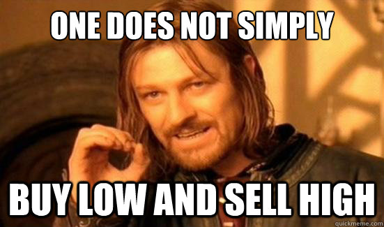

<p align="center">
    
</p>

[]()
[]()
[]()
[]()

# Step 11 - The Trader Strategy

[](https://github.com/datawithdanny/sql-masterclass/tree/main/course-content/step10.md)
[](https://github.com/datawithdanny/sql-masterclass/tree/main/course-content/step12.md)

# Scenario 3: The Trader



Nandita is the Queen of crypto trading - she wants to follow the popular trader's adage of **BUY LOW, SELL HIGH**

## Nandita's Transaction History

* She also starts out with a 50 BTC and ETH purchase just like Leah and Vikram
* She continues to buy more crypto over the 4 years
* She starts selling some of her crypto portfolio to realise gains

## Nandita's Data

This final scenario 3 is actually exactly the same as our real `trading.transactions` dataset!

To complete our individual scenarios before we calculate all our metrics for all mentors - let's also prepare another temp table called `nandita_trading_strategy`

```sql
CREATE TEMP TABLE nandita_trading_strategy AS
SELECT * FROM trading.transactions
WHERE member_id = 'a87ff6';
```

You can inspect the data by running the following query after creating the temp table above:

```sql
SELECT * FROM nandita_trading_strategy LIMIT 10;
```

| txn_id | member_id | ticker |  txn_date  | txn_type |     quantity     | percentage_fee |          txn_time          |
| ------ | --------- | ------ | ---------- | -------- | ---------------- | -------------- | -------------------------- |
|      3 | a87ff6    | BTC    | 2017-01-01 | BUY      |               50 |           0.00 | 2017-01-01 00:00:00        |
|     19 | a87ff6    | ETH    | 2017-01-01 | BUY      |               50 |           0.20 | 2017-01-01 00:00:00        |
|     41 | a87ff6    | ETH    | 2017-01-01 | BUY      | 1.98666102006509 |           0.30 | 2017-01-01 17:39:10.894181 |
|     49 | a87ff6    | ETH    | 2017-01-02 | BUY      | 8.78673520720906 |           0.30 | 2017-01-02 04:48:50.044665 |
|     53 | a87ff6    | BTC    | 2017-01-02 | BUY      | 5.95980481918755 |           0.30 | 2017-01-02 09:55:27.347188 |
|     60 | a87ff6    | BTC    | 2017-01-02 | BUY      | 9.01117722642621 |           0.30 | 2017-01-02 17:16:29.062839 |
|     64 | a87ff6    | ETH    | 2017-01-02 | BUY      | 1.37715908309016 |           0.01 | 2017-01-02 20:49:33.771818 |
|     77 | a87ff6    | BTC    | 2017-01-03 | BUY      | 3.80769453794553 |           0.30 | 2017-01-03 12:30:20.779105 |
|     89 | a87ff6    | BTC    | 2017-01-04 | BUY      | 5.68677206948404 |           0.00 | 2017-01-04 08:13:07.752195 |
|     93 | a87ff6    | BTC    | 2017-01-04 | BUY      | 8.13772499730359 |           0.30 | 2017-01-04 12:25:48.367139 |
<br>

## Final Evaluation Metrics

By the end of our assessment period on the 29th of August 2021 - we can calculate Nandita's metrics as follows for each individual BTC and ETH portfolio:

* Count of buy and sell transactions
* Total investment amount of purchases
* The dollar amount of fees for purchase transactions
* Dollar cost average of purchases
* Total gross revenue of sell transactions
* Average sell price for each unit sold
* Final portfolio value and quantity
* Profitability measured as (final portfolio value + gross sales revenue - purchase fees - sales fees) / initial investment amount

**Bonus Question**

We also want to calculate the difference if Nandita didn't sell any of her crypto and compare it to the final value at the end of August - how much does this impact her overall profitability?

## Solutions

### Question 1

> Calculate Nandita's purchase metrics for each of her BTC and ETH portfolios:
>
> * Count of purchase transactions
> * Initial investment
> * Purchase fees
> * Dollar cost average of purchases

> My Solution: 

```

```

<br>

| ticker | purchase_count |    purchase_quantity    |      initial_investment      |        purchase_fees         |    dollar_cost_average    |
| ------ | -------------- | ----------------------- | ---------------------------- | ---------------------------- | ------------------------- |
| BTC    |            954 | 5023.705687783492459935 | 63735345.6973630892576024850 | 162919.943377863222128081502 | 12686.9187126851255182628 |
| ETH    |            756 |   3822.0371970017654265 |   2287096.578215583047801140 |    5783.32678170688531189239 |    598.397257883758534604 |
<br>

### Question 2

> Calculate Nandita's sales metrics for each of her BTC and ETH portfolios:
>
> * Count of sales transactions
> * Gross revenue amount
> * Sales fees
> * Average selling price

> My Solution: 

```

```

<br>

| ticker | sales_count |    sales_quantity    |       gross_revenue        |         sales_fees         |  average_selling_price  |
| ------ | ----------- | -------------------- | -------------------------- | -------------------------- | ----------------------- |
| BTC    |         167 | 863.4858182768507102 | 10975745.05336688201117242 | 29522.09286188312984442411 | 12710.97315213559195557 |
| ETH    |          70 | 318.1506358514526923 |  172591.915512909206341725 |   447.93810830446683009024 |  542.484898862480594053 |
<br>

### Question 3

> What is Nandita's final BTC and ETH portfolio value and quantity?

> My Solution: 

```

```

<br>

| ticker |     final_quantity      |     final_portfolio_value     |
| ------ | ----------------------- | ----------------------------- |
| BTC    | 4160.219869506641749735 | 200751409.8030429976334624250 |
| ETH    |   3503.8865611503127342 |   11134790.869485909819250128 |
<br>

### Question 4 & 5 (bonus!)

> What is Nandita's overall profitability and theoretical profitability if she didn't sell any of her portfolio?

We will try to minimise how many times we access the temp table `nandita_trading_strategy` to optimise our query performance!

> My Solution: 

```

```

<br>

| ticker |     final_portfolio_value     |  actual_profitability   | theoretical_profitability |    dollar_cost_average    |  average_selling_price  |       sales_revenue        |        purchase_fees         |         sales_fees         |      initial_investment      |    purchase_quantity    |    sales_quantity    | purchase_transactions | sales_transactions |
| ------ | ----------------------------- | ----------------------- | ------------------------- | ------------------------- | ----------------------- | -------------------------- | ---------------------------- | -------------------------- | ---------------------------- | ----------------------- | -------------------- | --------------------- | ------------------ |
| BTC    | 200751409.8030429976334624250 | 3.318954506414827841503 |   3.800967820444996477195 | 12686.9187126851255182628 | 12710.97315213559195557 | 10975745.05336688201117242 | 162919.943377863222128081502 | 29522.09286188312984442411 | 63735345.6973630892576024850 | 5023.705687783492459935 | 863.4858182768507102 |                   954 |                167 |
| ETH    |   11134790.869485909819250128 |  4.94126554503705553061 |    5.30805715638391209991 |    598.397257883758534604 |  542.484898862480594053 |  172591.915512909206341725 |    5783.32678170688531189239 |   447.93810830446683009024 |   2287096.578215583047801140 |   3822.0371970017654265 | 318.1506358514526923 |                   756 |                 70 |
<br>

[](https://github.com/datawithdanny/sql-masterclass/tree/main/course-content/step10.md)
[](https://github.com/datawithdanny/sql-masterclass/tree/main/course-content/step12.md)